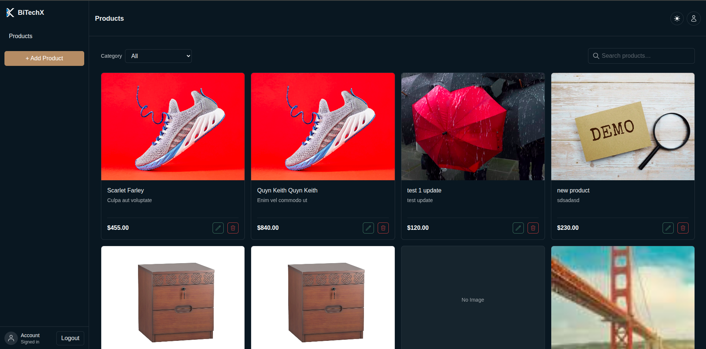
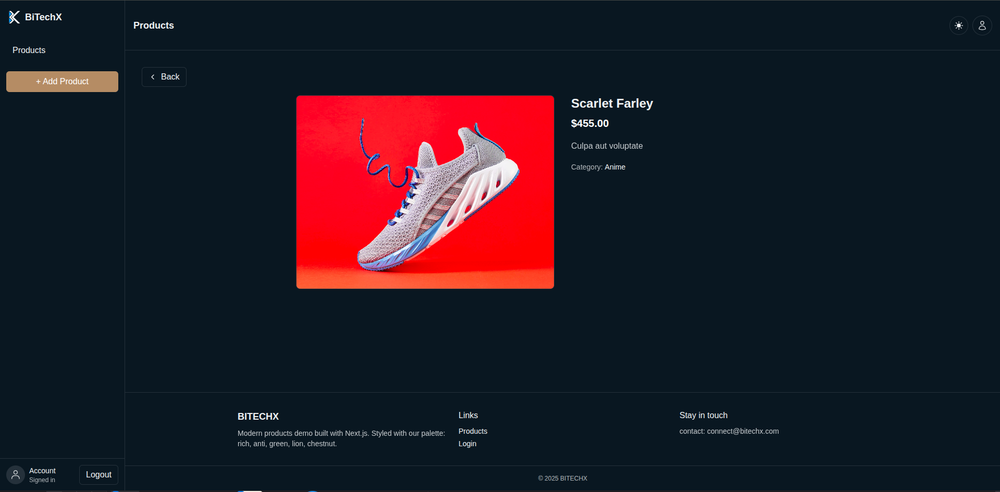

# BitechX – Product Catalog Dashboard

Modern product catalog built with Next.js 15 (App Router), TypeScript, Tailwind CSS v4, and a clean UI/UX. It supports authentication-gated access, product search, category filtering, pagination, and CRUD actions via polished modals.

<p align="center">
  <picture>
    <source media="(prefers-color-scheme: dark)" srcset="./public/logo-dark.svg">
    
  </picture>
</p>

## Tech Stack

<p>
  
  
  
  
  
  
  
  
  
</p>

- Dependencies are listed in `package.json` (Next 15.5, React 19, TypeScript 5, Tailwind 4, Zustand 5, SWR 2, next-themes, Heroicons, Framer Motion).

## Features

- Authentication-gated products pages using cookie `auth_token`.
- Product listing with search (`/products/search`) and category filter (`/categories`).
- Pagination with smart ellipsis and active page highlighting.
- Product details page at `app/products/[slug]/page.tsx`.
- Create and Edit product modals; Delete with confirmation modal.
- Robust image rendering with graceful fallback.
- Theme synchronization between `next-themes` and a persisted Zustand store.
- Clean, responsive UI built with Tailwind CSS (supporting light/dark themes).

## Project Structure

```text
app/
  components/
    ConfirmDeleteModal.tsx
    ConfirmSubmit.tsx
    Footer.tsx
    LoadingSpinner.tsx
    Logo.tsx
    Navbar.tsx
    ProfileDropdown.tsx
    SearchLoadingBridge.tsx
    ThemeBridge.tsx
    ThemeToggle.tsx
    UserBar.tsx
  products/
    [slug]/page.tsx        # Product details (server component)
    page.tsx               # Products grid, filters, pagination (server component)
    ProductActions.tsx     # Edit/Delete actions (client component)
    CategoryFilter.tsx     # Category dropdown filter
    CreateModal.tsx        # Create product modal
    EditModal.tsx          # Edit product modal
stores/
  useThemePref.ts          # Zustand stores for theme and basic products state
public/
  logo-light.svg, logo-dark.svg, globe.svg, file.svg ...
```

## Key Implementation Notes

- `app/products/page.tsx`
  - Fetches products and categories from `process.env.NEXT_API_BASE`.
  - Handles optional `q` (search), `categoryId`, and `page` via `searchParams`.
  - Pagination is computed from `limit = 12` with a friendly pager.
  - Displays skeletons while loading and a contextual “No Product Found” message when applicable.
  - Only the product title (`<h3>`) is a clickable link to details, avoiding unwanted card-level navigation.

- `app/products/[slug]/page.tsx`
  - Loads an individual product by `slug`.
  - Shows a safe image, price formatting, and a back link to `/products`.

- `app/products/ProductActions.tsx`
  - Client component for Edit/Delete.
  - Edit opens the Edit modal by updating URL params (`edit=1&productId=...`).
  - Delete opens a confirmation modal and calls `deleteProductAction`, then `router.refresh()`.
  - Click handlers call `e.preventDefault()` and `e.stopPropagation()` to prevent unintended navigation.

- `app/components/ThemeBridge.tsx`
  - Bridges `next-themes` effective theme (light/dark/system) into a persisted Zustand store (`useThemePref`).

- `stores/useThemePref.ts`
  - Zustand store for theme preference (persisted).
  - Includes a simple products store (add/update/remove) used for client-side state where needed.

## Environment Variables

Create a `.env.local` with the following:

```bash
NEXT_API_BASE=https://your-api.example.com
```

The application expects:

- `GET ${NEXT_API_BASE}/products` → returns an array of products
- `GET ${NEXT_API_BASE}/products/search?searchedText=<q>` → filtered array of products
- `GET ${NEXT_API_BASE}/categories` → list of categories
- `GET ${NEXT_API_BASE}/products/:slug` → single product

Authentication token is read from the `auth_token` cookie.

## Scripts

```bash
pnpm dev     # Start dev server (Turbopack)
pnpm build   # Build (Turbopack)
pnpm start   # Start production server
pnpm lint    # Lint
```

You can also use npm, yarn, or bun as shown below.

## Getting Started

1) Install dependencies

```bash
pnpm install
# or
npm install
```

2) Configure environment

```bash
cp .env.local.example .env.local   # if you track an example file
# then set NEXT_API_BASE
```

3) Run the app

```bash
pnpm dev
# or
npm run dev
```

Open http://localhost:3000

## Screenshots





